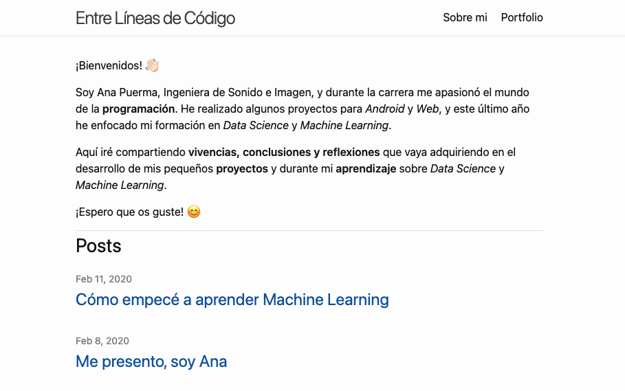
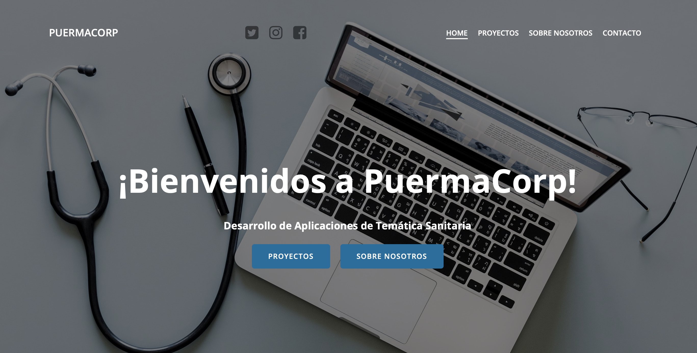
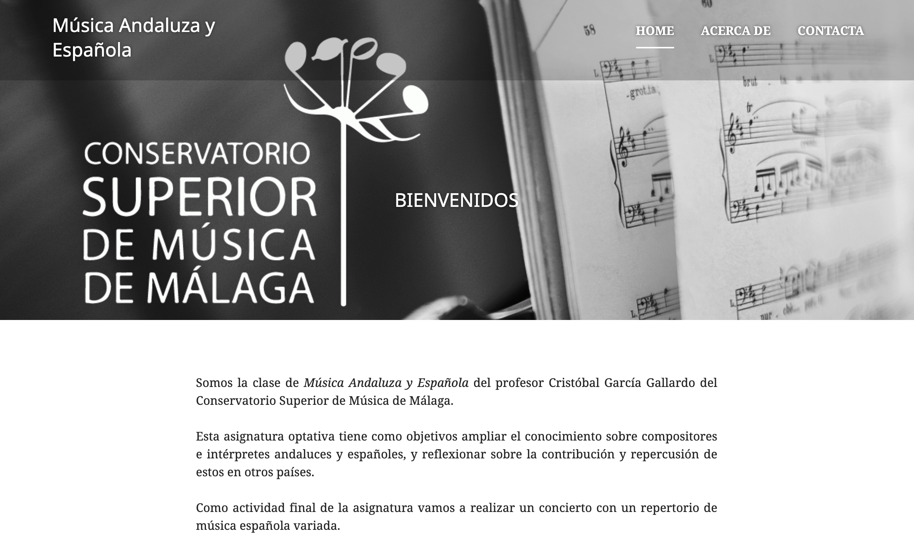
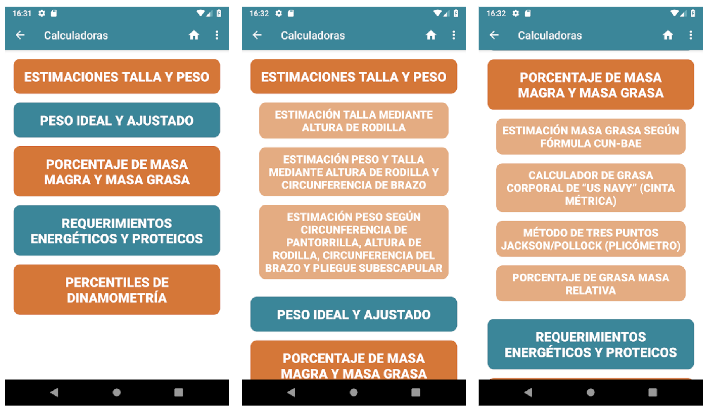
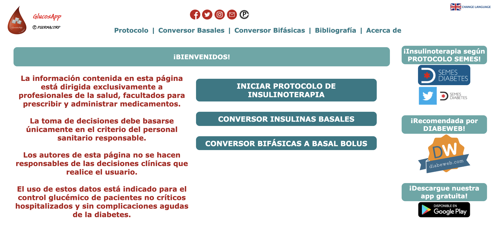
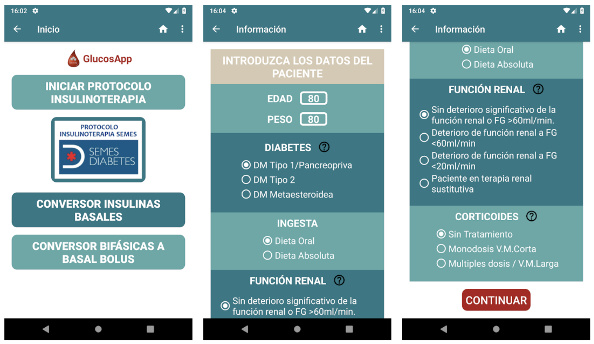

### Web Personal en Github  

*2021* 

Este sitio web-blog surgió con la finalidad de compartir vivencias, conclusiones y reflexiones que vaya adquiriendo en el desarrollo de mis pequeños proyectos y durante mi aprendizaje sobre Data Science y Machine Learning... 👉🏻 [leer más](/proyectos/web-personal-github/)

### Web de PuermaCorp

*2019*

Este sitio web recoge la información de la empresa PuermaCorp y de sus proyectos de aplicaciones para profesionales sanitarios... 👉🏻 [leer más](/proyectos//web-puermacorp/)

### Web de Música Andaluza y Española

*2019*

Sitio web de la asignatura optativa de Música Andaluza y Española, impartida por el profesor Cristóbal García Gallardo en el Conservatorio Superior de Música de Málaga durante el curso 2018-2019... 👉🏻 [leer más](/proyectos/web-mae/)

### NutrenApp para Android

*2018*

Esta aplicación de ámbito sanitario para Android contiene diversas calculadoras nutricionales... 👉🏻 [leer más](/proyectos/android-nutrenapp/)

### GlucosApp Web

*2017*

Esta aplicación web de ámbito sanitario contiene una calculadora de dosis de insulina y conversoras entre tipos de insulina... 👉🏻 [leer más](/proyectos/web-glucosapp/)

### GlucosApp para Android

*2017*

Esta aplicación de ámbito sanitario para Android contiene una calculadora de dosis de insulina y conversoras entre tipos de insulina... 👉🏻 [leer más](/proyectos/android-glucosapp/)

